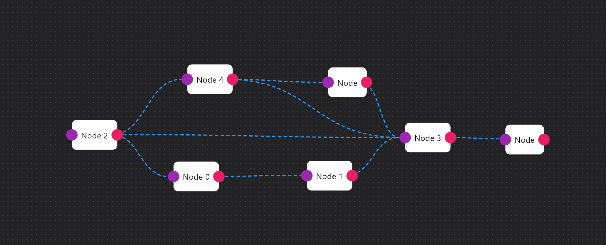

# Luke Flow Diagram



A customizable, interactive **Flutter flow diagram library** inspired by React Flow.  
Supports drag & drop nodes, sockets, edges (Bezier), pan & zoom, and dynamic connections.

---

## 🚀 Features

- Custom nodes with builder functions
- Pan & zoom support (with `CustomInteractiveViewer`)
- Node socket system (input/output ports)
- Connect nodes with Bezier edges (dashed or solid)
- Large canvas support
- Controller-based architecture for programmatic updates

- Much more....

---

## 📦 Installation

Add to your `pubspec.yaml`:

```yaml
dependencies:
  luke_flow_diagram: version
```

🛠️ Usage

```dart

import 'package:luke_flow_diagram/luke_flow_diagram.dart';

class MyFlowCanvas extends StatelessWidget {
  @override
  Widget build(BuildContext context) {
    final controller = LukeFlowCanvasController<DataModelExample>();
    
    return LukeFlowCanvas<DataModelExample>(
        controller: controller,
        nodes: nodes,
        initialConnections: connections,
        nodeBuilder: (node) {
            //Create your custom nodes here
            return Container(
                padding: const EdgeInsets.all(16),
                decoration: BoxDecoration(
                    color: node.data?.color ?? Colors.white,
                    borderRadius: BorderRadius.circular(8),
                ),
                child: Center(
                    child: Text(
                        node.data?.name ?? 'Node',
                        style: TextStyle(color: Colors.black),
                    ),
                ),
            );
        },
        onUpdate: (n, c) {
            // LukeFlowCanvas handles all its state internaly, but you can
            //Use this function to get the updated data, or use the controller.
            nodes =n;
            connections = c;
        },
    );
  }
}

```

✨ Customization

Grid background: density, color, dots vs lines

Node rendering: fully customizable via nodeBuilder

Socket dimensions: adjustable width, height, radius

BezierEdge: dashed or solid, color configurable

Minimap: (coming soon)